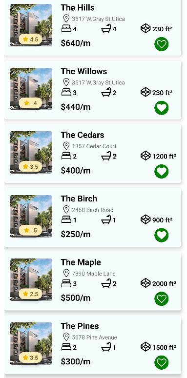

# App Inmobiliaria

> [Ver instrucciones antes de iniciar](./instructions.md)

## Description
This application has been developed for a real estate company to showcase their available rental properties to clients. The app 
allows the real estate company to display a list of all the properties available for rent
## Table of Contents

- [Features](#features)
- [Requirements](#requirements)
- [Installation](#installation)
- [Usage](#usage)
- [Contribution](#contribution)
- [Credits](#credits)
- [App Screenshots](#app-screenshots)

## Features

    -Property Listing: The app presents a comprehensive list of all the properties available for rent.
    -Detailed Information: For each property, the following information is provided:
        Name: Descriptive name of the property.
        Address: Physical location of the property.
        Bedrooms: Number of bedrooms in the property.
        Bathrooms: Number of bathrooms in the property.
        Area: Total area of the property in square meters.
        Monthly Rent: Monthly rental cost of the property.
        Property Rating: Evaluation or rating of the property based on quality and features.
        Favorite Marking: Users can mark properties they like using a special icon.

## Requirements
    -Mobile device compatible with the platform (iOS/Android).
    -Internet connection to access the available properties.

## Installation
    -Clone or download the repository.
    -Open the project folder in your preferred development environment.
    -Install the project dependencies using the command npm install.
    -Configure the necessary environment variables for the development environment.
    -Run the application using the command npm start.
    -The application will open on your emulator or mobile device.

## Usage

Upon opening the application, you will be presented with a list of properties.
Each property listing will display a photo, address, name, price, bathrooms, bedrooms, area, and a functional like button.
You can mark properties as favorites by tapping the like button.

## Contribution
We appreciate your interest in contributing to our application! If you would like to contribute, please follow these steps:

-Create a new branch for your contribution.
-Make the necessary changes or enhancements in your branch.
-Ensure that the changes adhere to the project's style guidelines and best practices.
-Submit a pull request to the main branch of the repository.
-Our team will review your contribution and merge it if it meets the project's standards.

## Credits
- [BrightCoders](http://www.brightcoders.com/)
- [Axw3ll](axelomar.a.v@gmail.com)

## App Screenshots

